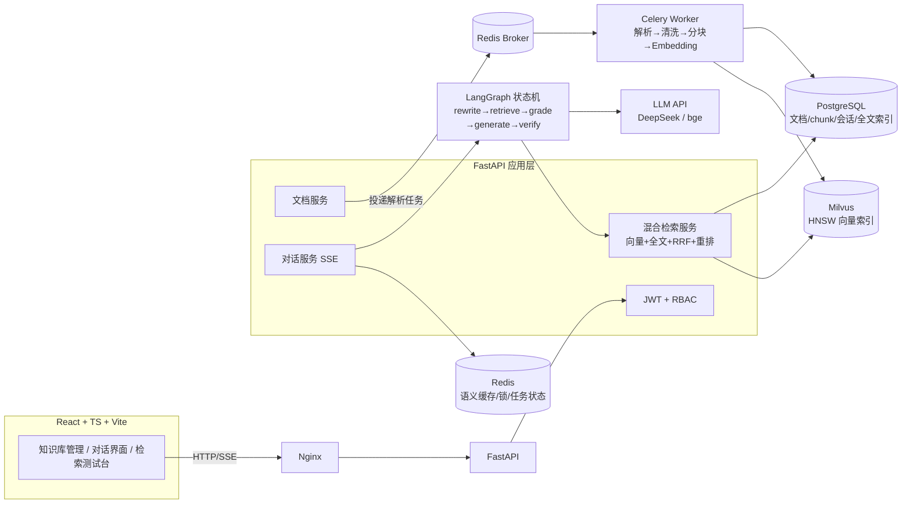

# DocMind 项目上下文（AI 开发简报）

> 本文件是自包含的项目简报：新会话读此一份即可开工，无需其他背景。
> 配套：规划背景见 `003-Project/01-岗位调研与项目方案.md`，总流程见 `003-Project/04-开发文档.md`（可选阅读）。
> 开发者：Asize（大三，软件工程，主力 JS，正学 Python/FastAPI；此前已完成 OneHub 网关项目，FastAPI/Celery/Redis/SSE 已有基础）。

---

## 1. 项目定位

**DocMind**：基于 Agentic RAG 的企业知识库问答平台。文档上传后经异步解析管线入库，提问时走"查询改写 → 混合检索 → 自我评估 → 重试/生成"的智能体工作流，SSE 流式输出并带引用溯源。

- **目的**：简历核心项目，对标**AI 应用开发 / Agent 开发**实习岗
- **面试叙事**："讲一个你做的 RAG/Agent 深度优化"——检索质量、幻觉治理、Agent 编排
- **周期**：W5–W10（OneHub 完成后的 6 周）
- **前提**：OneHub 的 FastAPI 脚手架、Celery、Redis、SSE 模式直接复用，本项目不再从零搭

## 2. 技术栈（严格遵守）

| 层 | 技术 |
|---|---|
| 后端 | Python 3.12 + FastAPI + Pydantic v2 + Uvicorn |
| ORM/迁移 | SQLAlchemy 2.0（async）+ Alembic |
| 关系库 | PostgreSQL 16（元数据/会话/全文检索） |
| 向量库 | Milvus 2.x standalone（compose 带 etcd+minio） |
| 任务队列 | Celery + Redis（文档解析管线） |
| 缓存 | Redis（语义缓存 + 任务状态 + 分布式锁） |
| AI 编排 | LangGraph（Python 版 StateGraph） |
| 模型 | **生成**：DeepSeek `deepseek-flash`（= DeepSeek-V4.1-Flash）/ `deepseek-v4-pro`，OpenAI 兼容；**嵌入**：`BAAI/bge-m3`（1024 维）；**重排**：`BAAI/bge-reranker-v2-m3`。后两者走硅基流动，DeepSeek 官方无 embedding / rerank 端点（2026-09 核实） |
| 文档解析 | pypdf / python-docx / markdown + tiktoken 计数 |
| 前端 | React 18 + TypeScript + Vite + TailwindCSS + Zustand + EventSource |
| 部署 | Docker Compose（api/worker/beat/pg/milvus/etcd/minio/redis/nginx） |

**RAG 框架约束**：**不用 LangChain 的 RAG 链**，检索管线（分块/召回/RRF/重排/压缩）全部原生实现；编排层用 LangGraph（其 StateGraph 仅做流程控制）。理由：原生实现才讲得清每一环——这是面试卖点，属于保护清单。

## 3. 架构



## 4. 目录结构

```
docmind/
├── AGENTS.md               # 项目规则（含本项目保护清单）
├── docker-compose.yml      # 9 容器：api/worker/beat/pg/milvus/etcd/minio/redis/nginx
├── backend/
│   ├── pyproject.toml
│   ├── alembic/
│   ├── app/
│   │   ├── main.py
│   │   ├── core/           # 配置、安全、redis/milvus 客户端
│   │   ├── models/         # SQLAlchemy 表
│   │   ├── schemas/        # Pydantic 模型
│   │   ├── api/            # auth / documents / conversations / chat(SSE) / retrieval_test
│   │   ├── services/
│   │   │   ├── retrieval.py    # 双路召回+RRF+重排+压缩（原生实现）
│   │   │   ├── embeddings.py   # bge-m3 封装（批量）
│   │   │   └── semantic_cache.py
│   │   ├── rag/
│   │   │   ├── graph.py        # LangGraph 状态机
│   │   │   ├── nodes.py        # rewrite/retrieve/grade/generate/verify
│   │   │   └── citation.py     # 引用对齐校验
│   │   └── workers/ingest.py   # Celery 解析管线
│   ├── examples/mini_agent.py  # 手写 mini-agent 循环（教学实物，W8）
│   └── tests/
├── frontend/               # 打字机渲染/引用卡片/推理时间线/文档管理
└── docs/
    ├── task_plan.md        # planning-with-files-zh 三件套
    ├── notes.md
    ├── adr/
    └── 评估报告.md          # RAGAS 优化前后对比
```

## 5. 数据库与向量库规格

### 5.1 PG DDL

```sql
CREATE TABLE documents (id BIGSERIAL PRIMARY KEY, user_id BIGINT REFERENCES users(id), filename VARCHAR(255) NOT NULL, file_path TEXT NOT NULL, file_type VARCHAR(16), size_bytes BIGINT, status VARCHAR(16) DEFAULT 'uploaded', error_msg TEXT, chunk_count INT DEFAULT 0, created_at TIMESTAMPTZ DEFAULT now());
-- 状态机：uploaded → parsing → chunking → embedding → ready | failed（可重试）
CREATE TABLE chunks (id BIGSERIAL PRIMARY KEY, document_id BIGINT REFERENCES documents(id) ON DELETE CASCADE, chunk_index INT NOT NULL, content TEXT NOT NULL, token_count INT, tsv tsvector, created_at TIMESTAMPTZ DEFAULT now());
CREATE INDEX idx_chunks_tsv ON chunks USING GIN(tsv);
CREATE INDEX idx_chunks_doc ON chunks(document_id);
CREATE TABLE conversations (id BIGSERIAL PRIMARY KEY, user_id BIGINT REFERENCES users(id), title VARCHAR(128), created_at TIMESTAMPTZ DEFAULT now());
CREATE TABLE messages (id BIGSERIAL PRIMARY KEY, conversation_id BIGINT REFERENCES conversations(id) ON DELETE CASCADE, role VARCHAR(16) NOT NULL, content TEXT, citations JSONB, created_at TIMESTAMPTZ DEFAULT now());
```

（users 表沿用 OneHub 结构。）

### 5.2 Milvus Collection

- `doc_chunks { chunk_id INT64 PK, embedding FLOAT_VECTOR(1024) [bge-m3], document_id INT64, user_id INT64 }`
- 索引：HNSW（M=16, efConstruction=200），metric=COSINE
- 检索时带 user_id 过滤（数据隔离）

## 6. 核心算法规格（保护清单，按规格原生实现）

### 6.1 分块（W5）

递归分割（按 `\n\n` → `\n` → 句号逐级降级），目标 chunk=512 token、overlap=64，tiktoken 计数；参数存配置可调（检索测试台在线改）。

### 6.2 混合检索 + RRF + 重排（W7）

- 向量路：query embedding → Milvus Top-50
- 关键词路：PG tsvector 全文检索 Top-50
- 融合：`score(d) = Σ 1/(60 + rank_r(d))`（r 遍历两路）
- 重排：bge-reranker-v2-m3 对融合 Top-N 打分 → 取 Top-8
- 压缩：token 预算内拼装上下文
- **验收标准**：自建 20 query 评测集，混合检索命中率 > 纯向量（对比数据记录留档）

### 6.3 LangGraph 状态机（W8）

```
State: {messages, query, rewritten, docs[], grade, answer, citations[], retries}
rewrite → retrieve → grade ─(≥0.6)→ generate → verify ─(pass)→ END
            ↑                                  └─(fail)→ fallback 拒答 → END
            └─(<0.6 且 retries<3)──────────────┘
```

- grade：LLM 对检索结果与 query 的相关性打分（0-1）
- 循环上限 3 次；每步发 `node_enter/node_exit` 事件（SSE reasoning 通道）
- **verify 引用对齐**：答案按句拆分 → 提取 [n] 标注 → 对应句与 chunk n 做 embedding 相似度（阈值 0.75）→ 任一引用不达标 → 重写一次 → 仍失败 → 拒答模板（"知识库中未找到充分依据"）

### 6.4 手写 mini-agent（W8，教学实物）

`examples/mini_agent.py`：不用任何框架，裸实现 tool_calls 循环——消息历史管理 → 解析 tool_calls → 执行工具 → ToolMessage 回传 → 终止判定。带 2 个示例工具（计算器/文档查询）。用途：teach 教学与 LangGraph 对比祛魅，面试答"不用框架也能实现"。

### 6.5 语义缓存（W10）

问题 embedding 与 Redis 缓存集（问/答/向量）相似度 > 0.92 → 直接返回（响应标注"命中缓存"）；TTL 24h；缓存集上限 LRU 淘汰。

### 6.6 API 端点清单

- `POST /api/auth/register|login`
- `POST /api/documents`（multipart，返回 task_id）、`GET /api/documents`、`GET /api/documents/{id}/progress`、`DELETE /api/documents/{id}`
- `POST /api/conversations`、`GET /api/conversations`
- `POST /api/chat`（**SSE 事件类型：token / citation / reasoning / done / error**）
- `POST /api/retrieval/test`（在线调 chunk/TopK/温度/阈值，返回命中对比）
- `GET /api/citations/{chunk_id}`（引用定位原文）

## 7. 开发计划（W5–W10）

### W5 OpenSpec 开工 + 摄取管线
- **任务 0（人工介入点）**：OpenSpec 建 changes/ 提案流（proposal → spec → tasks），后续 RAG 参数迭代均以 change 提案演进；AGENTS.md（替换为本项目保护清单）+ planning 三件套
- 脚手架复用 OneHub 模式 + compose 加 Milvus——验收：全家桶健康
- JWT + 用户体系；文档上传 → Celery 管线（解析→清洗→分块）——验收：**10MB PDF 上传不阻塞 API，状态机进度可查**
- 失败重试 + 错误回写——验收：坏文件 failed 可重试
- **teach**：FastAPI、SQLAlchemy、JWT/RBAC、Celery

### W6 向量化 + 朴素 RAG（先跑通再优化）
- bge-m3 批量 embedding → Milvus 入库——验收：chunk_count 与 Milvus 数一致
- 基础问答链路（query→embed→TopK→prompt→LLM）——验收：文档内容问答命中
- SSE 生成端流式——验收：curl 逐 token 可见
- **teach**：Embedding 原理、Milvus/HNSW、SSE 生成端（对比 OneHub 转发端）

### W7 混合检索 + 多轮记忆
- PG 全文路 + RRF 融合 + bge 重排 + 压缩——验收：**20 query 评测集，混合 > 纯向量（数据留档）**
- 多轮会话：PG 持久化 + 滑动窗口 + 摘要压缩——验收：第 10 轮记得第 1 轮关键信息
- **teach**：分块策略、PG 全文、RRF、重排（bi vs cross）、多轮记忆
- 📌 **简历上墙点 3**：基础版上简历

### W8 mini-agent + LangGraph Agentic RAG（教学重头周）
- 手写 mini-agent 循环（examples/）——验收：带工具对话跑通
- LangGraph 状态机（6.3 规格）——验收：grade<0.6 自动 rewrite 重试（日志可见），循环上限生效
- 推理可视化事件流——验收：前端收到 reasoning 事件
- **teach**：手写 mini-agent、LangGraph（对比手写：框架封装了什么）、CRAG/Self-RAG

### W9 前端 + 引用溯源
- 打字机渲染/会话列表/文档管理（dogfood 通过）
- 引用卡片：[1][2] 标注 → 点击跳原文档高亮 chunk——验收：引用可点可定位
- 推理时间线组件（消费 W8 事件流）
- **teach**：引用对齐 + 前端 EventSource（复用课程 output_parser 所学）

### W10 语义缓存 + 评估 + 收官
- 语义缓存（6.5 规格）——验收：重复提问秒回，命中率有数据
- 检索测试台（参数 A/B）；RAGAS 评估（忠实度/答案相关性/上下文精确率）——验收：优化前后两轮报告留档
- dogfood + compose 一键部署 + README——验收：全新机器可用
- **teach**：语义缓存、幻觉治理/RAGAS、Docker 编排
- 📌 **简历上墙点 4**：完整版上简历（RAGAS 对比 + 检索提升数据入 R 部分）

## 8. AI 工作规则（每会话生效）

### 8.1 流程

1. 会话开始：读 AGENTS.md 与 docs/task_plan.md 同步进度
2. 周初：dev-grill-docs / dev-plan 出周计划，**等开发者确认**后动工
3. 核心算法（RRF/引用对齐/语义缓存/mini-agent）：**dev-tdd 先写测试**
4. 全程 karpathy-guidelines；RAG 参数迭代走 OpenSpec change 提案
5. 完工：webapp-testing 验收 + dev-verify 拿证据；dev-code-review + ponytail-review（保护清单豁免）+ dev-commit-writer

### 8.2 保护清单（手写实现，禁止换库，审查豁免）

- 检索管线原生实现（分块/召回/RRF/重排/压缩——**不用 LangChain RAG 链、不用 LlamaIndex**）
- 手写 mini-agent 循环（examples/，零框架）
- 引用对齐校验自实现
- 语义缓存自实现
- LangGraph 仅限编排层（StateGraph 流程控制），节点逻辑全部手写

### 8.3 禁改清单

- `.env` 真实密钥不入 git；`alembic/versions/` 只增不改；`docs/task_plan.md` 不虚构进度；Milvus collection schema 变更需走 OpenSpec 提案

### 8.4 停机点（必须停下等人工）

1. OpenSpec proposal 产出后——开发者审
2. 周计划产出后——开发者确认
3. 架构级决策（新依赖/改 DDL/改 collection）——先记 ADR 等批

## 9. 环境与密钥（开工前人工准备）

- Docker Desktop（Milvus standalone 需 etcd+minio）、Python 3.12、Node 20 + pnpm
- `.env`：`DEEPSEEK_API_KEY`（生成）、`SILICONFLOW_API_KEY`（bge-m3 embedding + bge-reranker-v2-m3，硅基流动）、`DATABASE_URL`、`REDIS_URL`、`MILVUS_URI`、`SECRET_KEY`
- 评测语料：准备 2-3 份结构化文档（如课程笔记/产品手册 PDF）+ 20 个问题评测集
